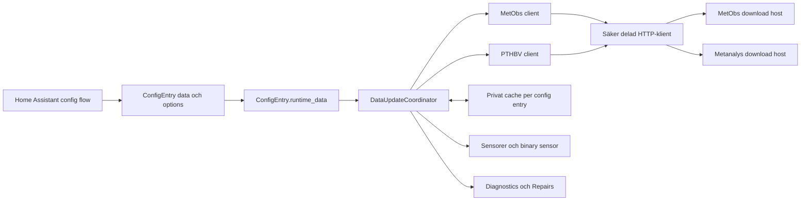

# Arkitektur

## Status och läsanvisning

Det här dokumentet beskriver både den kod som finns i repositoryt och de verifieringsgrindar som återstår. Följande ord används konsekvent:

- **Implementerat:** beteendet finns i aktuell kod.
- **Beslutat kontrakt:** metod eller avgränsning är godkänd som mål men kan fortfarande sakna komplett implementation eller testbevis.
- **Verifierat:** det finns ett aktuellt och reproducerbart test- eller livebevis.
- **Öppen grind:** beteendet får inte betraktas som releaseklart ännu.

Per 2026-09-03 är arkitekturen implementerad och lokalt verifierad med full pytest/coverage, hassfest och Home Assistant-liveprov. HACS repository/releasekontroll och CI är publiceringsgrindar eftersom repositoryt uttryckligen ska förbli lokalt och ocommittat.

## Systemöversikt



En config entry representerar en användarvald plats. Beständig identitet, koordinater och stationsval ligger i `ConfigEntry.data`; valbara funktioner och jämförelseår ligger i `ConfigEntry.options`. Ett slumpgenererat `location_id` används i device- och entity-identiteter så att stationer och options kan ändras utan att unique IDs byts.

## Specialistteam och granskningsansvar

Arbetet delades 2026-09-03 mellan följande specialistroller. Rapporterna är beslutsunderlag; huvudagenten behöver fortfarande verifiera kod och grindar själv.

| Roll | Viktigaste beslut eller granskning |
|---|---|
| Projektledare/teknisk ledare | Scope, fasordning, ocommittad lokal leverans och stoppvillkor |
| SMHI API-specialist | Officiell API-matris, MetObs-parametrar, PTHBV-kontrakt, cacheheaders, kvalitet och liveprober |
| Home Assistant-integrationsutvecklare | `ConfigEntry.runtime_data`, coordinator-lifecycle, config/options/reconfigure flow, entity naming, diagnostics och Repairs |
| Data- och beräkningsspecialist | UTC/lokal tid, fysiska DST-timmar, skottdag, 75-procentsgrind, midrank och cirkulär vindriktning |
| Säkerhets- och integritetsspecialist | HTTPS-allowlist, redirectvalidering, storleksgränser, atomisk cache och positiv allowlist i diagnostics |
| Test-/QA-specialist | Testmatris, offline-fixtures, gränsfall och verifierat krav på >95 procent per produktionsmodul |
| HACS-/release-specialist | Flat HACS-zip, deterministiskt bygge, SHA-256/SBOM, branchmodell och icke-publicerande verifiering |
| Dokumentations-/UX-specialist | Svenska/engelska begrepp, installationsflöde, entity-tabell, integritet, felsökning och öppna grindar |
| Home Assistant runtime-specialist | Verifierad installation, restart, loggar, entity read-back, rådatafacit och repo/runtime-paritet |

Arkitektur-, beräknings- och säkerhetsbeslut fick separata specialistperspektiv och huvudagenten verifierade därefter den sammanbyggda lösningen lokalt och i runtime.

## Context7-kontroll 2026-09-03

Context7-resolvern valde den officiella dokumentationskällan **Home Assistant Developer Docs** med library ID:

```text
/websites/developers_home-assistant_io
```

Följande två frågeområden kontrollerades:

1. Modern cloud-polling integration: config flow, `ConfigEntry.runtime_data`, Home Assistants delade `aiohttp`-session, `DataUpdateCoordinator`, first refresh, unload och entity availability.
2. Integration Quality Scale och tester: config-flow coverage, >95 procent per integrationsmodul, translations, diagnostics, Repairs, reconfigure/options flow och disabled-by-default entities.

Kontrollen gav följande arkitekturkonsekvenser:

- Den delade Home Assistant-sessionen injiceras i API-klienten; integrationen skapar ingen egen session.
- Första hämtningen går via `async_config_entry_first_refresh()`, så ett tillfälligt setupfel kan hanteras av Home Assistants config-entry-lifecycle.
- Samlad runtime-data lagras i `entry.runtime_data`.
- Platforms forwardas vid setup och unloadas med `async_unload_platforms()`.
- Entiteter är `CoordinatorEntity`-baserade och egen availability-logik kombineras med `super().available`.
- UI-baserad config flow, dubblettskydd, options och reconfigure ingår.
- Mindre vanliga och tekniska entities är disabled by default.
- Diagnostics och Repairs används där användaråtgärd eller felsökningsunderlag behövs.
- Full config-flow coverage och mer än 95 procents coverage för samtliga integrationsmoduler är obligatoriska releasegrindar, inte dokumentationspåståenden.

Context7-exemplet för config-flow-texter visar core-integrationens `strings.json`-struktur. Det aktuella custom-repositoryt använder fullständiga `translations/en.json` och `translations/sv.json`; paketeringen passerade hassfest och laddades av Home Assistant 2026.9.0.

Primära dokumentationssidor från kontrollen:

- [Fetching data](https://developers.home-assistant.io/docs/integration_fetching_data)
- [Inject websession](https://developers.home-assistant.io/docs/core/integration-quality-scale/rules/inject-websession)
- [Entity unavailable](https://developers.home-assistant.io/docs/core/integration-quality-scale/rules/entity-unavailable)
- [Integration Quality Scale checklist](https://developers.home-assistant.io/docs/core/integration-quality-scale/checklist)
- [Config flow](https://developers.home-assistant.io/docs/core/integration/config_flow/)

## Config-entry-lifecycle

### Setup

`async_setup_entry` normaliserar data och options till `EntryOptions`, skapar API-klienter, entry-isolerad cache och coordinator, kör first refresh och forwardar därefter `sensor` och `binary_sensor`.

Runtime-objektet innehåller:

- säker HTTP-klient;
- MetObs-klient;
- PTHBV-klient;
- cache;
- coordinator;
- normaliserade options.

### Unload och removal

Platforms unloadas genom Home Assistants standardlifecycle. När en config entry tas bort rensas endast den entryns cachekatalog. Koden öppnar inga egna långlivade HTTP-sessioner och ska därför inte stänga Home Assistants delade session.

### Migration

Entry-version 1, minor version 1, lägger till ett beständigt `location_id` för äldre entries. Andra entry-versioner avvisas i migrationen. Migreringsbeteendet behöver fortfarande komplett integrationstest.

## Config flow och ägarskap av data

Config flow är flerstegsbaserad:

```text
user/reconfigure → content → comparisons → stations → confirm
```

`ConfigEntry.data` innehåller platsnamn, koordinater, beständigt plats-ID samt valda stationers ID och namn. `ConfigEntry.options` innehåller aktiverade produkter och jämförelseår.

Deterministiskt unique ID för dubblettskydd bygger på koordinater avrundade till fyra decimaler. Entity unique IDs bygger däremot på det beständiga `location_id` och entity-nyckeln. En reconfigure behåller `location_id` men uppdaterar entryns koordinatbaserade unique ID.

Config flow gör små livekontroller: stationsmetadata och ett begränsat PTHBV-år. De stora MetObs-arkiven och den långa PTHBV-serien hämtas först efter att entryn skapats.

## Datahämtning och coordinator

Den aktuella implementationen använder en coordinator med 30 minuters update interval. Varje uppdatering:

1. validerar valda stationers periodstöd högst en gång per dygn;
2. hämtar valda MetObs `latest-day`-serier parallellt;
3. identifierar senaste giltiga observation och stale-status;
4. laddar eller återanvänder dagens historik;
5. beräknar värden och små provenance-attribut;
6. publicerar source status till entities och diagnostics.

Historik uppdateras när lokalt datum ändras. Cache med högst 28 dagars ålder återanvänds för corrected archive och PTHBV. Om en ny hämtning misslyckas används äldre, checksummeverifierad cache när den finns.

Planen beskrev möjliga separata coordinators för aktuella och långlivade data. Koden använder en coordinator med internt separata refreshregler: first refresh hämtar bara aktuell data och den tunga historiken startas som en config-entry-bunden bakgrundsuppgift. Liveprovet visade cirka 3,6 sekunders setup och korrekt efterföljande cache-/historikfyllning.

## Nätverksgräns

Alla meteorologiska anrop går genom samma klient. Den implementerar:

- endast HTTPS;
- exakt hostname-allowlist;
- endast standardport 443;
- blockering av userinfo, fragment och osäkra portformer;
- automatiska redirects avstängda;
- validering av varje redirect och högst tre same-host-hopp;
- total-, connect- och read-timeout;
- begränsade retries för idempotenta läsanrop och vissa tillfälliga statuskoder;
- `Accept-Encoding: gzip`, vilket PTHBV kräver;
- storlekskontroll via både `Content-Length` och räknad stream;
- MIME- och parserkontroll.

Se [Integritet och säkerhet](privacy.md) för dataflöde och hotgränser.

## Cache

`SourceCache` lagrar versionerad JSON under:

```text
<HA config>/.storage/smhi_weather_context/<entry_id>/
```

Filnamnet är en SHA-256-baserad hash av cache-nyckeln. Payload och metadata skyddas med en checksumma. Skrivning sker till en temporär fil med privata rättigheter och publiceras med atomisk `replace`. Symlänkar avvisas. Fil-I/O körs via Home Assistants executor.

Korrupt, felversionerad eller checksummefelaktig cache ignoreras och hämtas om. Ingen separat karantänfil skapas, vilket undviker att rå providerdata dupliceras och lämnas kvar; beteendet är testat som den säkra v1-strategin.

## Entity- och device-modell

Varje config entry skapar en device för platsen. Alla entities har `has_entity_name = True` och stable unique ID:

```text
<location_id>_<entity_key>
```

Sensorer hämtar ett beräknat värde ur coordinatorn. Om den specifika nyckeln saknar värde blir entityn unavailable. Detta isolerar en saknad datapunkt. Riktade coordinator- och entitytester finns, men källspecifik availability och partial-failure-beteende behöver fortfarande godkännas i full testsvit och liveprov.

Attribut hålls små: källprodukt, stations-ID, observationstid, stickprovsstorlek och attribution när de finns. Fulla tidsserier exponeras inte till Recorder.

## Release- och brancharkitektur

Repositoryts branchmodell är:

```text
feature/fix → dev → beta → main
```

- `beta` ger semantic-release prerelease.
- `main` ger stabil release.
- `dev` är integrationsbranch och analyseras inte som releasebranch.
- Promotion ska ske med riktiga merge commits.

Releaseverktyget bygger en flat HACS-zip med normaliserade timestamps och rättigheter, injicerar version endast i artifactets manifest och skapar SHA-256 samt SPDX 2.3-SBOM. Två rena byggen ska vara byteidentiska. Ett riktigt semantic-release dry-run kräver Git-historik och brancher och är därför en framtida, uttryckligen godkänd grind.

## Verifiering och kvarvarande begränsningar

- Lokal verifiering 2026-09-03 gav 223 godkända tester och 99,80 procent total branch coverage. Se testdokumentet för reproducerbara kommandon.
- `PARALLEL_UPDATES = 0` är deklarerat för coordinatorstyrda platforms; loggning exakt en gång vid bortfall/återhämtning är inte styrkt.
- Stationsrankningen använder ännu inte verifierad faktisk luckfrihet eller kvalitetsandel.
- Cachen är entry-isolerad; planens idé om delning av ofarlig gemensam stationscache är inte implementerad.
- PTHBV:s färska data saknar kvalitets-/preliminärmarkering och används därför inte som “slutligt kontrollerad” aktuell observation.
- Liveinstallation, restart, loggar, entity metadata och byteparitet verifierades i utvecklingsinstansen 2026-09-03.
- Aktuella GitHub Actions-resultat finns i repositoryts Actions-flik. En riktig HACS-nedladdning kräver en publicerad releaseasset.

Se [Testning](testing.md) för exakta grindar. Den privata lokala driftsloggen distribueras inte med repositoryt.
